# Article Scaffolding
## The Case for Browser Agents
Browser agents are about to take center stage yet most people reading this are likely going to miss it.
I assume my readers are highly technical so the right answer for when to use a browser agent essentially boils down to "As a last resort. If the MCP fails and the API fails and we cant build our own API for them then and only then should I use a browser agent."
To the non-technical non-SWE they often have no option but to use a browser agent.
Here is the logic behind this: https://www.linkedin.com/feed/update/urn:li:activity:7481285576047063041/
It is the non-technical consumer that will be adopting it en masse.

## Limits of Browser Agents
Browser agents in premise are fantastic untill you kick one off, wait 60 seconds for it to begin, 10 seconds to scroll down, another 10 seconds to scroll again, finally clicks to navigate somewhere...
At which point you cancel the task and do it yourself.
Or you just leave it running hoping it does the right thing, come back 30 minutes later to find it failed, or worst case, it did the wrong thing and took actions you have to correct or cannot even revert.

The browser agent's failure modes can be destructured into the following:
1. Latency: it is too slow to maintain the user's attention
2. Efficiency: it takes several more turns than a human would, introducing risk of adverse effects in the state of the target system.  
3. Correctness: The browser agent may fail to complete the task.

I explored a series of methods to unilaterally improve accross each of these axes against a clean room version of Claude in Chrome.
The expectation was that any naive method would be sufficient to improve accross all three axes, this was not the case. But after several phases of experimentation I discovered that by distilling prior experience into a prompt-embedded recipe together with a warmed-up session the agent can significantly beat the baseline accross all three axes.

<figure style="text-align:center;margin:1.5em auto">
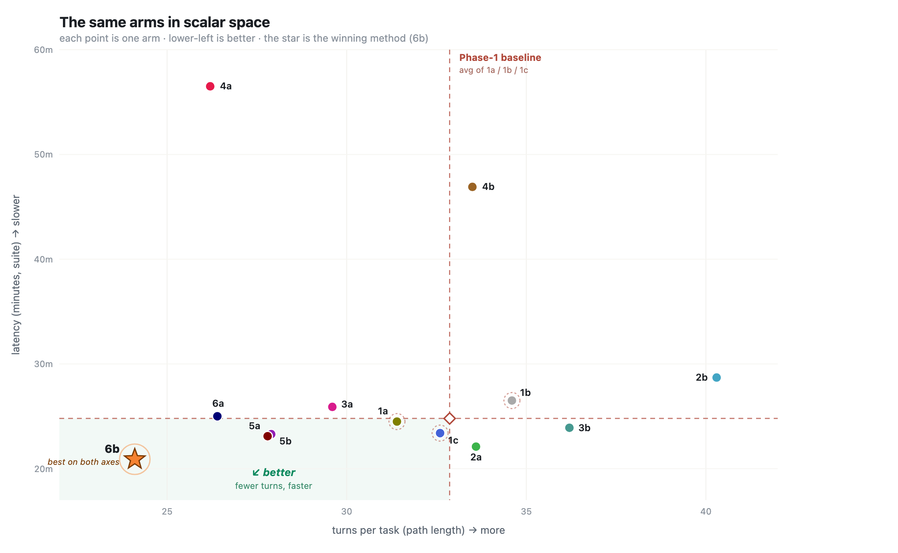
<figcaption style="max-width:640px;margin:0.6em auto 0;font-size:13px;font-style:italic;color:#6b675e;line-height:1.5">Every arm placed by turns (path length) and end-to-end latency. The dashed crosshair marks the Phase-1 baseline, the average of the three baseline arms (1a, 1b, 1c); anything in the shaded lower-left beats it on both axes at once. The winning method, 6b, sits farthest into that corner.</figcaption>
</figure>

This is the story of this experimentation and discovery.

## Study setup

Throught every single run of the study the same underlying model was used: Claude Sonnet 5 at Medium effort. 

### Dataset
The study begins with the dataset.
The dataset used is a stratified subset sourced from the REAL web-agent benchmark.
The REAL dataset consists of 112 tasks designed to run against 11 target sites.
The study focused on 2 sites, "dashdish" (DoorDash clone) and "zilloft" (Zillow clone) on the basis that each had enough easy/medium and hard tasks to get a large enough sample size to both train and test on.
Each side with a total of 7 easy/medium tasks and 2 hard tasks.
Three medium tasks were randomly selected from each target site to build the train set.
The remaining 12 composed the held-out test set.

Caveat 1:
Although REAL provides difficulty labels for each task they were quickly saturated by the study baseline.
Caveat 2: Some evaluations were not consistent between semantically equivalent LLM outputs.
Caveat 3: The 12th task's evaluation was ambiguous and I will argue that its label is incorrect.

The target sites store their state in the sites cache and each site must follow a specific configuration to setup the task. Then an actor runs against the site. Finally the state of the site is captured and then scored against REAL's evaluation script.

### Factors
For each arm of the study, we phased in different factors and measured their impact across the three axes.
Each factor is defined as follows and is accompanied by a pictoral metaphor to help illustrate the concept.

#### Harness
The key factor from which this whole study is built is the harness.
The harness has 2 levels the official closed source Anthropic harness Claude in Chrome (CinC) and an augmented clean room version aptly named open-claude-in-chrome (OCIC).
Why make a clean room version? Three reasons:
1. Claude in Crhome controls which sites you have access to, this significantly limits the degrees of freedom of Claude resulting in people building unecessary companies from this limitation.
2. Claude in Chrome limits the extension to only work on Chrome and Edge, if you use a different browser you are out of luck.
3. Claude in Chrome harness uses several methods that slow down the agent and may decrease performance in other axes, that is completely out the user's control.

OCIC solves each of these problems in turn expanding utility and improving performance by design, resulting in a roughly .1s improvement per round trip call.

There is only a signle arm that uses CinC, it serves as the control group for the study.

<figure style="text-align:center;margin:1.5em auto">
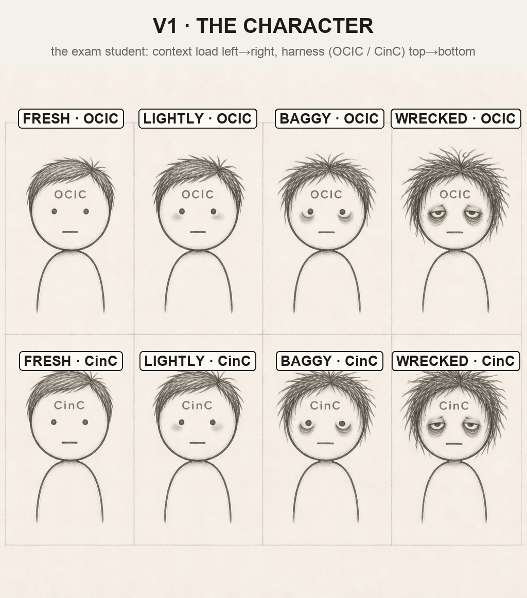
<figcaption style="max-width:600px;margin:0.6em auto 0;font-size:13px;font-style:italic;color:#6b675e;line-height:1.5">The harness is represented by the forehead branding on the character's forehead.</figcaption>
</figure>

#### Browser
The browser is the substrate within which the agent operates, similar to the harness, this contains two levels: Chrome and Brave.

There is only two arms that use the Chrome browser, the rest use Brave.

<figure style="text-align:center;margin:1.5em auto">
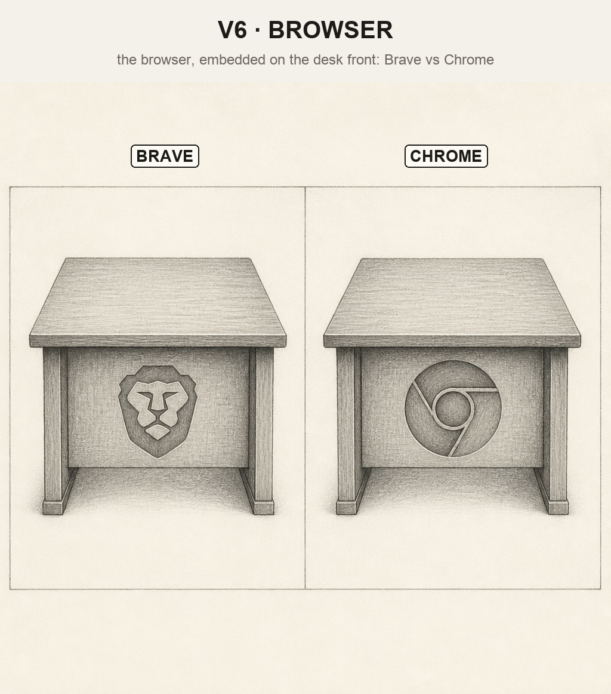
<figcaption style="max-width:600px;margin:0.6em auto 0;font-size:13px;font-style:italic;color:#6b675e;line-height:1.5">This factor is representated as the table the student to do their work on.</figcaption>
</figure>

#### Context Load
This factor is tremendously influential, as it wholistically dictates the latency of inference. Context load represents the amount of context already loaded into the claude run session in an arm before the task is kicked off.

<figure style="text-align:center;margin:1.5em auto">
 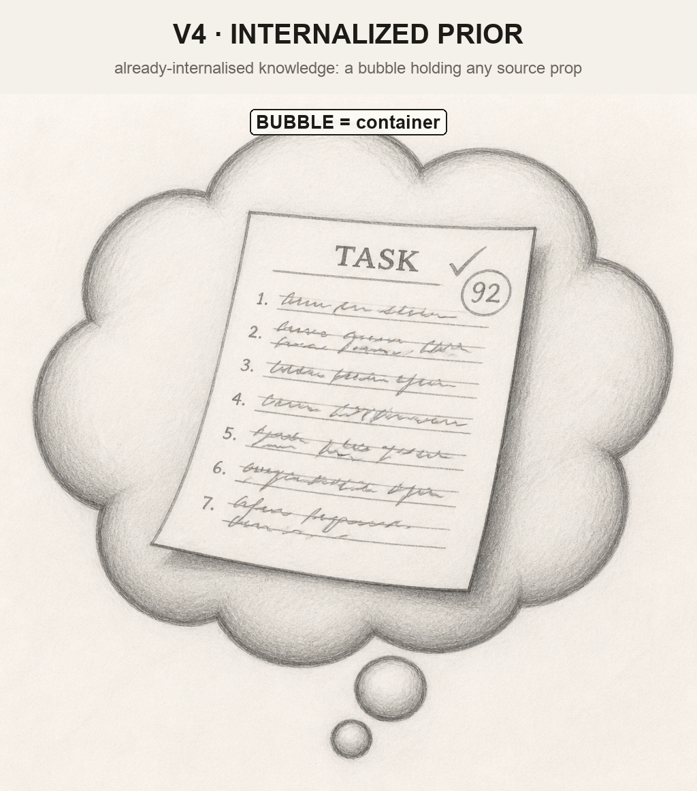
<figcaption style="max-width:600px;margin:0.6em auto 0;font-size:13px;font-style:italic;color:#6b675e;line-height:1.5">The context load is represented by the apparent tiredness of the student and a though bubble. This representation is more direct than many of the other factors as they have a monotonic relationship. If you study more hours and you are tired you are likely to perform worse; If you load more context in the session the inference latency will increase.The though bubble accompanies the tireness to visualize the internalized material that was loaded into the context.</figcaption>
</figure>

#### Source
The source represents the kind of trajectory format. In our case we have two levels: self generated and expert demonstrations.
Self generated or experiential trajectory represents the agent's own attempts at solving the train set of tasks.
Expert demonstrations are captured via a new feature to OCIC in session recordings. These recordings capture several types data simultaneously including: behavioral actions, cognitive transcripts, and cursor movements.

<figure style="text-align:center;margin:1.5em auto">
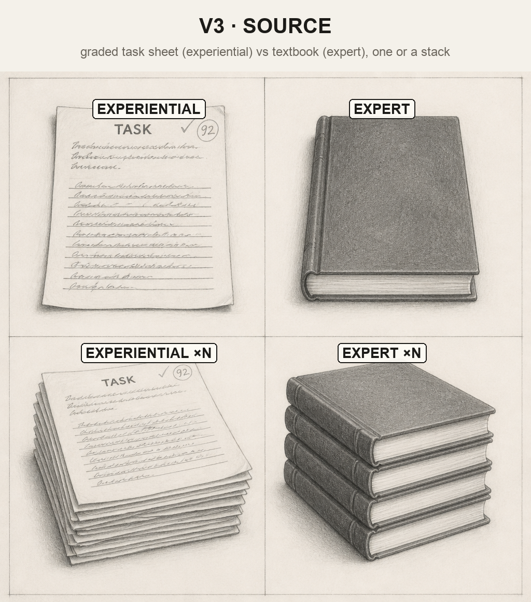
<figcaption style="max-width:600px;margin:0.6em auto 0;font-size:13px;font-style:italic;color:#6b675e;line-height:1.5">The experiential is represented by completed tasks showcasing the agent's prior attempts at solving similar problems. Alternatively the expert demonstration are represented as a book illustrating an experts recollection of their attempts at solving similar problems.</figcaption>
</figure>

#### Compression Delivery
In some instances we perform an analysis of the sources in essense compressing them. The compression is then delivered in two ways. First as an independent document added to the workspace. Second is as an artifact appended to the task prompt.

<figure style="text-align:center;margin:1.5em auto">
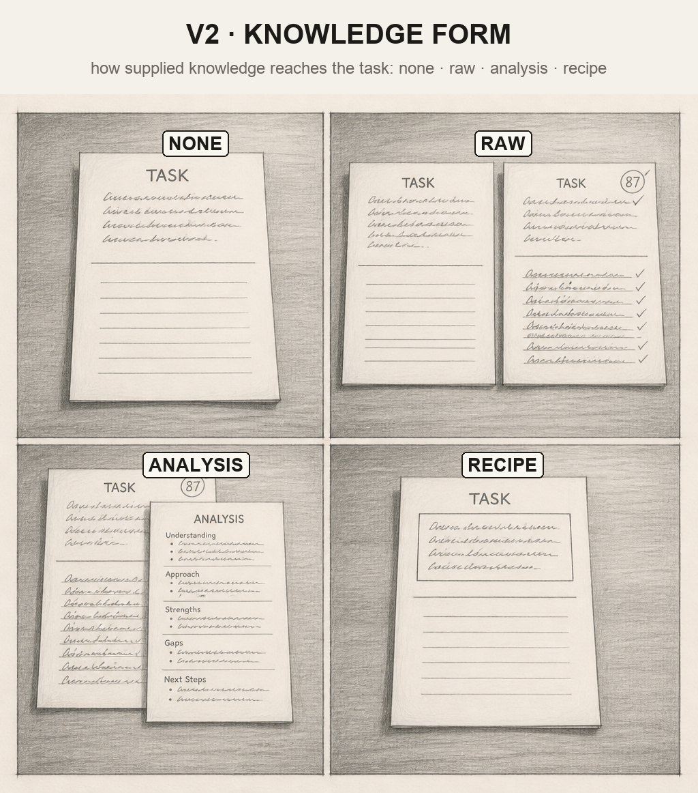
<figcaption style="max-width:600px;margin:0.6em auto 0;font-size:13px;font-style:italic;color:#6b675e;line-height:1.5">The compression is represented either by an analysis document often times sitting atop the source material or as a box inside the task paper an analog to reference material to an exam.</figcaption>
</figure>

### Study Arms
The study is motivated by personal experience building methods to drive better performance in browser agents.
I never formally studied the impact of these methods instead I relied on intuition.
The study is designed to investigate the impact of each of these methods in a controlled manner while ablating through levels to discover the atomic impact of each factor in the method.

#### Phase 1: Baseline
Baseline assessing the performance of the two harnesses.

##### 1a (CinC): CinC x Chrome
Claude in Chrome running in the stock Chrome Browser.

##### 1b (OCIC-Ch): OCIC x Chrome
OCIC running in the stock Chrome Browser.

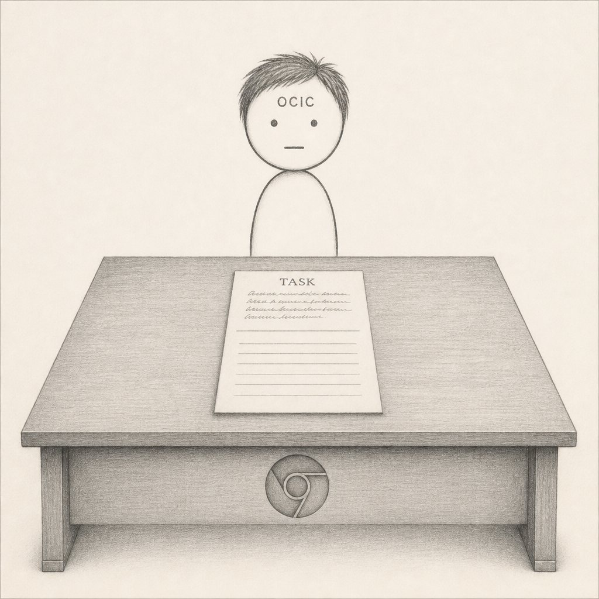

##### 1c (OCIC-Br): OCIC x Brave
OCIC running in the Brave Browser.

#### Phase 2: Sources in Workspace
Phase 2 is driven by the hypothesis that giving the agent access to similar trajectories in its workspace will drive better performance contingent on the agent seeking relevant information via agentic search.

##### 2a: OCIC x Brave x Experiential (workspace)
OCIC running in the Brave Browser with prior experience trajectories in its workspace (plus a readme for context on what exists in the workspace).

##### 2b: OCIC x Brave x Expert (workspace)
OCIC running in the Brave Browser with prior expert trajectories in its workspace (plus a readme for context on what exists in the workspace).

#### Phase 3: Analyzed Workspace Sources
Following up on the discovery of the reduced performance of phase 2 I hypothesized that providing an analysis of the sources would reduce the lookup time needed to build a model of the sites. Phase 3 is designed to test this hypothesis.

##### 3a: OCIC x Brave x Experiential (workspace) x Analysis Docs
OCIC running in the Brave Browser with prior experience trajectories in its workspace and an analysis document grounded on the prior sources already in the workspace (plus a readme for context on what exists in the workspace).

##### 3b: OCIC x Brave x Expert (workspace) x Analysis Docs
OCIC running in the Brave Browser with prior expert demonstrations in its workspace and an analysis document grounded on the prior sources already in the workspace (plus a readme for context on what exists in the workspace).

#### Phase 4: Context Loaded. Forks.
Building off the poor performance of phase 3 I learned that for the current difficulty of tasks the cost agentic search would not payoff. I hypothesized that instead of having the agent search through its workspace for priors you could naively reap the benefits of prior experience by loading the priors dirctly into context before running the task. 

##### 4a: OCIC x Brave x Experiential (context)
OCIC running in the Brave Browser with prior experience trajectories loaded into context naively by continuing the Claude session.

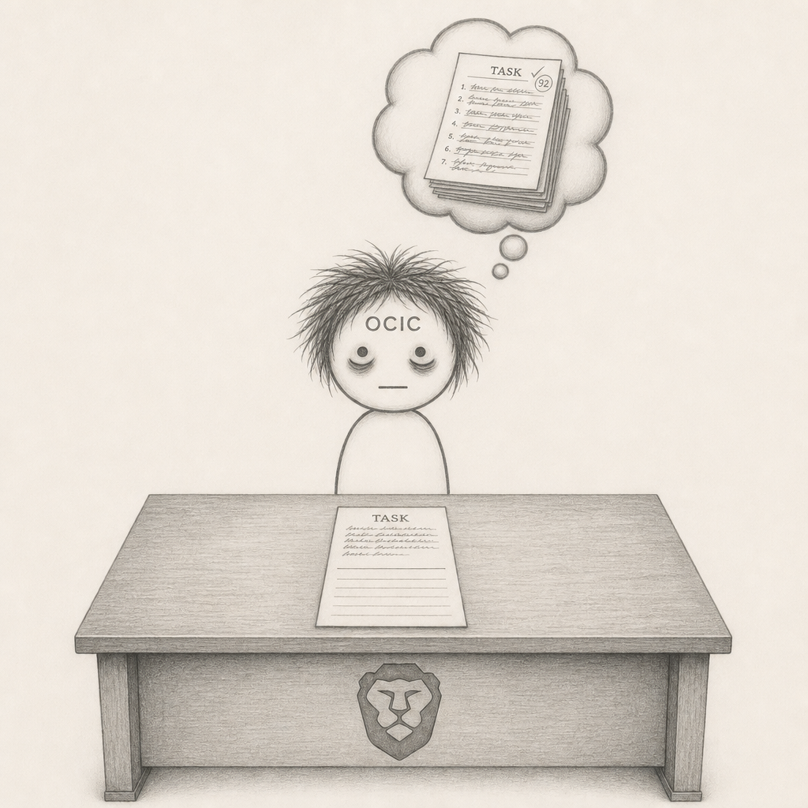

##### 4b: OCIC x Brave x Expert (context)
OCIC running in the Brave Browser with prior expert demonstrations internalized ahead of the task by performing a deep analysis of the expert demonstrations. Unlike 4a there is no means of loading the context naively so instead the agent internalized the context by operating on a workspace that contains the expert demonstrations. Over the course of internalizing the content the agent wrote notes onto disk which we represent as analysis documents.

#### Phase 5: Prompt Embedded Analysis 
Phase 4 helped me reminded me of a mechanic of LLMs where put simply more context results in higher latency. Drawing from that and prior phases I hypothesized that if the content of the experiences is distilled and embedded into the task prompt then the agent can reap the benefits of prior experience without the cost of agentic search nor the buildup of context.
For both arms of this phase the analysis artifacts are constructed by distilling both 6 expert demonstrations and 6 experience trajectories.

##### 5a: OCIC x Brave x Single Analysis Embedded Task
OCIC running in the Brave Browser with a single analysis artifact embedded into the task prompt. 

##### 5b: OCIC x Brave x Dynamic Analysis Embedded Task
OCIC running in the Brave Browser. Two artefacts are constructed from an analysis against the sources each focused on one site. The task prompt is paired with the corresponding artifact for the site.

#### Phase 6: Warm-up Context Loaded
After finally seeing phase 5 improve on the baseline I wanted to explore if you could get any benefits an experiential warm up (my intuition was stubborn on this). The hypothesis was that by loading in a prior task into the session the agent would improve its performance.

##### 6a: OCIC x Brave x Single Experiential (context)
OCIC running in the Brave Browser with a single prior experience trajectory loaded into context naively by continuing the Claude session.

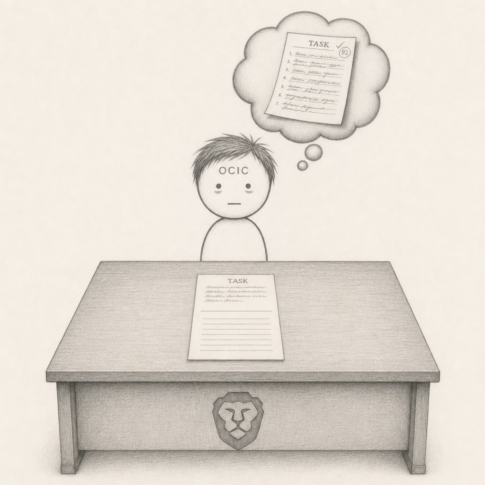

##### 6b: OCIC x Brave x Single Analysis Embedded Task x Single Experiential (context)
OCIC running in the Brave Browser with a single analysis artifact embedded into the task prompt and a single prior experience trajectory loaded into context naively by continuing the Claude session.

## Results
There were 3 major axis we are measuring against: latency, turns per task, and correctness.

## Accuracy
Accuracy suffered from two limitations:
1. The dataset was not challenging enough to test anything meaningfuly as it was quickly saturated from the baseline.
2. The evals were not consistent between semantically equivalent LLM outputs.

That being said accuracy is a good control to ensure the agent would not regress.

<figure style="text-align:center;margin:1.5em auto">
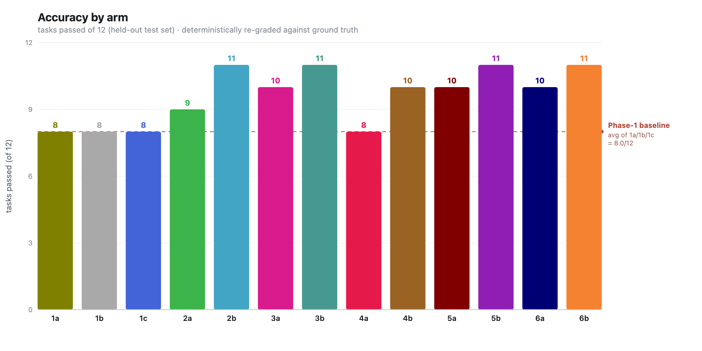
<figcaption style="max-width:640px;margin:0.6em auto 0;font-size:13px;font-style:italic;color:#6b675e;line-height:1.5">Tasks passed on the held-out test set (of 12), deterministically re-graded against ground truth. Nine of twelve tasks pass or fail identically across every arm; the three that vary (zilloft-2, zilloft-5, zilloft-10) were re-scored against the rubric's stated correct count after the LLM-judge grader was found to disagree with itself on identical answers.</figcaption>
</figure>

An important thing to observe is that accuracy across each of the phase 1 baseline arms is the same, this is the expected behavior as the LLM, the intelligence of the model, is the same across all arms.

The results indicate that within phases the results are fairly varied but if you groub by source you can see a clear trend where the expert demonstrations consistently perform better than the experiential trajectories.

<figure style="text-align:center;margin:1.5em auto">
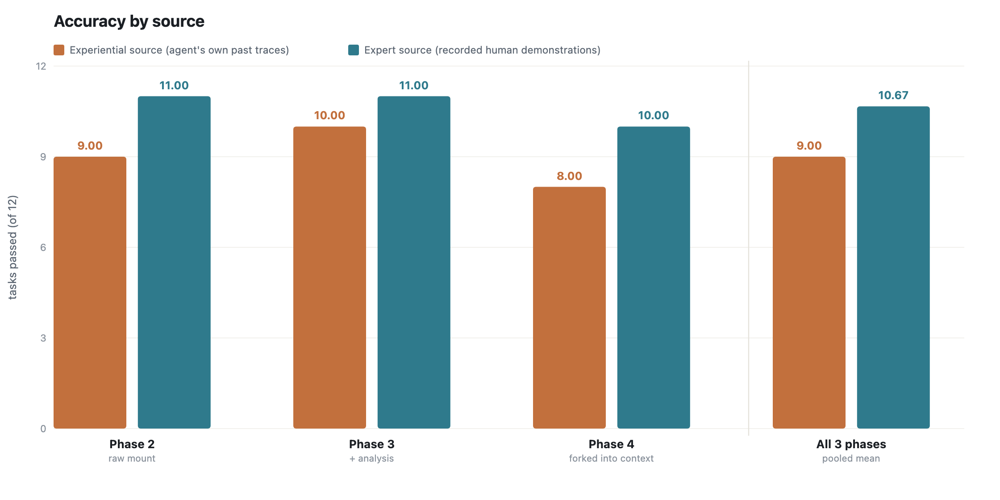
<figcaption style="max-width:640px;margin:0.6em auto 0;font-size:13px;font-style:italic;color:#6b675e;line-height:1.5">Tasks passed of 12, re-graded data, paired by phase. In phases 2, 3, and 4 the only factor that changes between the two bars is the source (experiential vs expert); the delivery mechanism (raw mount, +analysis, forked) is held fixed within each pair.</figcaption>
</figure>

This discreptancy is attributed sharply to a single type of task in zilloft where the page would not respond to a change in filters.
This type of issue is easier for a human to observe due to our continuous stream of visual input, but for an agent with discrete inputs it is a lot harder.
As a consequence the agent is inclined to take the inputs at face value knowing that it does not have the means validate page responsiveness.

So how did the expert demonstrations help in resolving this issue?
I obviously did not change the harness nor nature of a turn taking agent, so the answer lies in something much more simple but subtle.
By demonstrating an inclination to check and observe outcomes, I embedded a behavioral pattern of validation into the expert demonstrations.
Here is a quote from the expert demonstrations:
> "I can see that there's zero delivery fee on the first, second, third, fourth, and fifth, suggesting that there is probably delivery, but **I'm just going to double check.**"

and again

> "Well, first, **I just want to double check**. So the home... The phone looks good. The payment detail looks good."

This pattern was then picked up by the agent and followed in its exeution of test tasks.
The agent would verify that the page responded to the input by keeping watch for unresponsive states.

I would resist the urge to discredit this as happenstance, in part to the fact that i never intended to teach the agent this (but will do so in the future 😁), but also because this is the nuance of expert demonstrations. As humans we know what to expect and what to look out for in these tasks and have prior experience navigating sites that is more often than not never written down or captured in a dataset.

## Turn-count
While accuracy is a coarse binary measure of correctness, turn-count can serve as a higher resolution measure of correctness.
This hinges on the assertion neatly represented by the discount factor in reinforcement learning, immediate rewards are better than future rewards.
In short the less turns an agent takes towards a goal the more correct it is.
Analysing turn count surfaces more nuanced insights than we could gather from accuracy alone.

Turn count is parsed from the detached Claude Code run `num_turns` output. Generally it consists of a sequence of observe then think then act but it can vary.

The overall performance relative to the baseline average is shown below.

<figure style="text-align:center;margin:1.5em auto">

<figcaption style="max-width:640px;margin:0.6em auto 0;font-size:13px;font-style:italic;color:#6b675e;line-height:1.5">Each arm's mean turns per task against the Phase-1 cold baseline (32.9 turns/task, the average of 1a/1b/1c). Green bars ran shorter than cold; red bars ran longer. Arms ordered 1a&rarr;6b, matching the tool-call charts below. The dashed outline on 3a marks what its bar would be excluding one catastrophic task (zilloft-10); see the discussion below for why.</figcaption>
</figure>

The earlier methods of mounting prior experience into the workspace (phase 2 and 3) will require more turns to understand their workspace, which explains their performance. But by isolating for tool calls and separating them between browser use (CinC or OCIC) we can see a clearer picture.

<figure style="text-align:center;margin:1.5em auto">

<figcaption style="max-width:680px;margin:0.6em auto 0;font-size:13px;font-style:italic;color:#6b675e;line-height:1.5">Every tool call in each rollout, split by a strict name-prefix match and shown as percent versus its own cold baseline. Left: browser tool calls, any call whose name starts mcp__(open-)claude-in-chrome(-hybrid)__* &mdash; an action taken in the browser. Right: non-browser tool calls, the reject set, every call that is NOT a browser call (Bash, Read, Edit, Write, TaskCreate/Update, ToolSearch). Counts are sliced to start at the last task prompt in the session, so prep-phase activity (4a's forked prior session, 4b's live study session) is excluded the same way prep time is excluded from task time in the runtime chart above. The dashed outline on 3a's browser-call bar marks what it would be excluding the same catastrophic task noted above; non-browser calls barely move once that task is dropped, so only the browser panel is annotated.</figcaption>
</figure>

Now that we have isolated for browser tool calls we can assess the stated granular accuracy more directly.
This evidence supports the prior claims on the newly introduced validation behavior. Where you can see uniformly accross the expert legs that the agent is spending more turns on validation.

Independent of the added validation behavior you can see a clear improvement over the baseline across all arms.
The trend showcases that most methods will drive an improvement over turn count.
In fact even in the expert demonstrations legs you can see, across phases, the turns decrease in accordance to their experiential counterparts.
Even with the validation behavior the turn improvements are trending toward improving on the baseline.

There is also another interesting trend when you observe the turn saving with respect to the task length. The longer the task the more turn saving is observed.

<figure style="text-align:center;margin:1.5em auto">
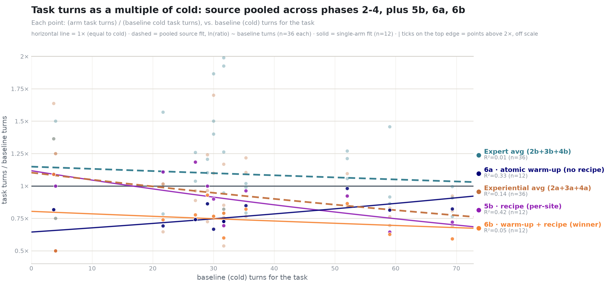
<figcaption style="max-width:680px;margin:0.6em auto 0;font-size:13px;font-style:italic;color:#6b675e;line-height:1.5">Each arm's own task turns divided by baseline (cold) task turns for the same task, plotted against baseline (cold) turns. Horizontal line is 1&times; (equal to cold). Dashed = pooled source fit, ln(ratio) &#126; baseline turns (experiential: 2a+3a+4a, expert: 2b+3b+4b, n=36 each); solid = single-arm fit (5b, 6a, 6b, n=12). Ticks along the top edge mark points above 2&times;, off scale.</figcaption>
</figure>

As you can see in the figure above the the y axis is set as a multiple of the baseline on every task.
That means that the trend illustrated by the best fit line showcases an exponential decay as the baseline turns taken increases.

## Latency
Finally we assess the metric that inspired this whole study, latency.
Latency is measured simply by the total time spent by the `claude -p ...` process on the task.
Latency as with any task is an essential metric whose quantitative improvements have a qualitative impact on user experience, possibly enabling new workflows and use cases.

(While latency per token generated is a function of the length of the context, I will not be discounting it as it is a reality to be contended with.)

<figure style="text-align:center;margin:1.5em auto">

<figcaption style="max-width:680px;margin:0.6em auto 0;font-size:13px;font-style:italic;color:#6b675e;line-height:1.5">Two rows per arm on one shared minutes scale, both left-aligned at 0: top is preparation time (stacked by step type, coloured by step), bottom is task time (the 12-run suite, arm colour). Aligned rather than stacked end-to-end, so prep duration and task duration compare directly instead of one offsetting the other.</figcaption>
</figure>

When it comes to latency we can see that the performance is entirely in the details of the implementation.
The key factor that did prove to be effective across all arms was appending analysis artifacts into the task prompt. The influence of that is observed across 5a, 5b, and 6b as they were the few that had a significant improvement over the baseline.

Similar to multiplier analysis of turn count above below is an analysis of the task time as a multiple of the baseline task time.

<figure style="text-align:center;margin:1.5em auto">

<figcaption style="max-width:680px;margin:0.6em auto 0;font-size:13px;font-style:italic;color:#6b675e;line-height:1.5">Each arm's own task time divided by baseline (cold) task time for the same task, plotted against baseline (cold) task time in minutes (average of 1a/1b/1c). Horizontal line is 1&times; (equal to cold). Dashed = pooled source fit, ln(ratio) &#126; baseline minutes (experiential: 2a+3a+4a, expert: 2b+3b+4b, n=36 each); solid = single-arm fit (5b, 6a, 6b, n=12). Ticks along the top edge mark points above 2&times;, off scale.</figcaption>
</figure>

Latency from this system can be attributed to two parts: model inference and harness overhead. Harness overhead, the program execution and the network round-trips a tool call makes through the harness, is a marginal contributor to per-turn latency (screenshots aside, where render cost can be significant). The dominant contributor is model inference itself.

<figure style="text-align:center;margin:1.5em auto">

<figcaption style="max-width:680px;margin:0.6em auto 0;font-size:13px;font-style:italic;color:#6b675e;line-height:1.5">Real measured seconds per turn, stacked: harness overhead (med_action, one browser action's measured round-trip through the harness) versus model inference (the remainder). Harness overhead ranges from 1.7% (4a) to 8.4% (1a) of per-turn latency across all 13 arms.</figcaption>
</figure>

Model inference further decomposes into three generation segments per turn: thinking, acting (tool-use), and the assistant messages. Thinking tokens are the most expensive of the three, so it's worth measuring how much of each turn's output they actually account for across arms.

Harness overhead holds at low single digits on every arm, confirming it's a marginal cost regardless of how long or short that arm's own per-turn latency runs.

Anthropic's API redacts thinking content from `usage.output_tokens` so the thinking tokens are estimated from the residual.

<figure style="text-align:center;margin:1.5em auto">
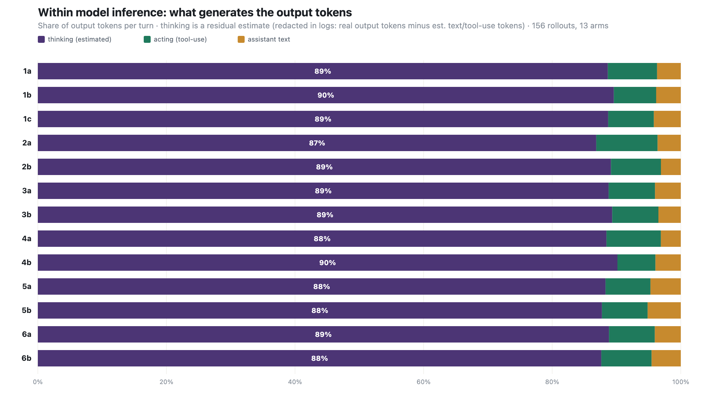
<figcaption style="max-width:680px;margin:0.6em auto 0;font-size:13px;font-style:italic;color:#6b675e;line-height:1.5">Estimated share of output tokens generated per turn, by generation type. Thinking is a residual estimate: real output tokens minus estimated text and tool-use tokens. 156 rollouts across 13 arms.</figcaption>
</figure>

<figure style="text-align:center;margin:1.5em auto">
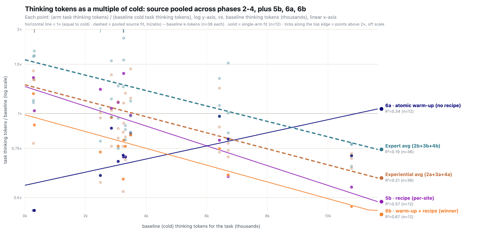
<figcaption style="max-width:680px;margin:0.6em auto 0;font-size:13px;font-style:italic;color:#6b675e;line-height:1.5">Each arm's own estimated total thinking tokens for a task divided by baseline (cold) thinking tokens for the same task, plotted against baseline thinking tokens in thousands (average of 1a/1b/1c). Horizontal line is 1&times; (equal to cold). Dashed = pooled source fit, ln(ratio) &#126; baseline k-tokens (experiential: 2a+3a+4a, expert: 2b+3b+4b, n=36 each); solid = single-arm fit (5b, 6a, 6b, n=12). Ticks along the top edge mark points above 2&times;, off scale.</figcaption>
</figure>

From the above multiplier analysis you will notice that it has a similar profile as the wall-time latency with a key difference being the added latency of token generation incurred by larger context sizes.

## Tying Them All Together
The two key axis to pay attention to are turns and latency.
Turns is selected over accuracy since it just represents a more granular measure of correctness.

<figure style="text-align:center;margin:1.5em auto">

<figcaption style="max-width:640px;margin:0.6em auto 0;font-size:13px;font-style:italic;color:#6b675e;line-height:1.5">Every arm placed by turns (path length) and end-to-end latency. The dashed crosshair marks the Phase-1 baseline, the average of the three baseline arms (1a, 1b, 1c); anything in the shaded lower-left beats it on both axes at once. The winning method, 6b, sits farthest into that corner.</figcaption>
</figure>

The graph above will serve to recap the key insights of the study. We will recap by phase which is in essence sequential steps of the study.

### Phase 1
<figure style="text-align:center;margin:1.5em auto">

1a

Official CinC &#183; Chrome &#183; setup-parity control

1b

OCIC &#183; Chrome &#183; cold

1c

OCIC &#183; Brave &#183; cold, the primary baseline

</figure>

The first phase showcased the parity of performance between Claude in Chrome and open-claude-in-chrome where the turn count and latency were roughly the same.

<figure style="text-align:center;margin:1.5em auto">

<figcaption style="max-width:640px;margin:0.6em auto 0;font-size:13px;font-style:italic;color:#6b675e;line-height:1.5">Same scalar-space plot as above (all 13 arms, turns vs. latency); 1a/1b/1c popped, everything else faded.</figcaption>
</figure>

### Phase 2
<figure style="text-align:center;margin:1.5em auto">

2a

Own past traces mounted on disk

2b

Expert recordings mounted on disk

</figure>

For phase 2 I began to experiment with loading prior experience into the workspace.
There was a heavy agentic search tax to internalize the content.
While 2a the turn count would not be recovered the latency did improve over the baseline.
On the other hand 2b would not improve on latency nor turn count due to the new behavior it did increase in accuracy.

<figure style="text-align:center;margin:1.5em auto">
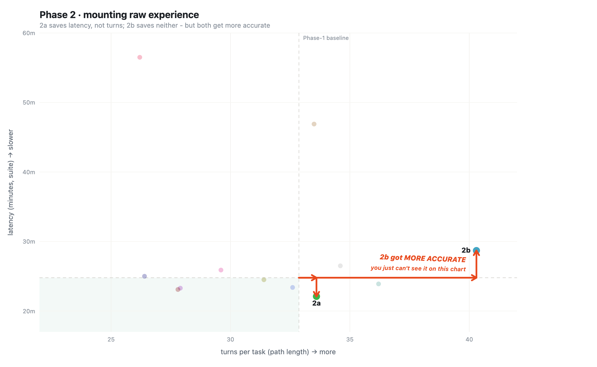
<figcaption style="max-width:640px;margin:0.6em auto 0;font-size:13px;font-style:italic;color:#6b675e;line-height:1.5">Same scalar-space plot; 2a/2b popped. 2b's accuracy improvement is real but isn't represented by either axis here.</figcaption>
</figure>

### Phase 3
<figure style="text-align:center;margin:1.5em auto">

3a

Compressed analysis of own runs, on disk

3b

Compressed analysis of expert recordings, on disk

</figure>

For phase 3 I attempted to reduce the agentic search tax by distilling the prior experience into a single analysis artifact present in the workspace.
This resulted in a reduction in turn count for both arms.
Yet surprisingly neither arm beat 2a on latency.

<figure style="text-align:center;margin:1.5em auto">
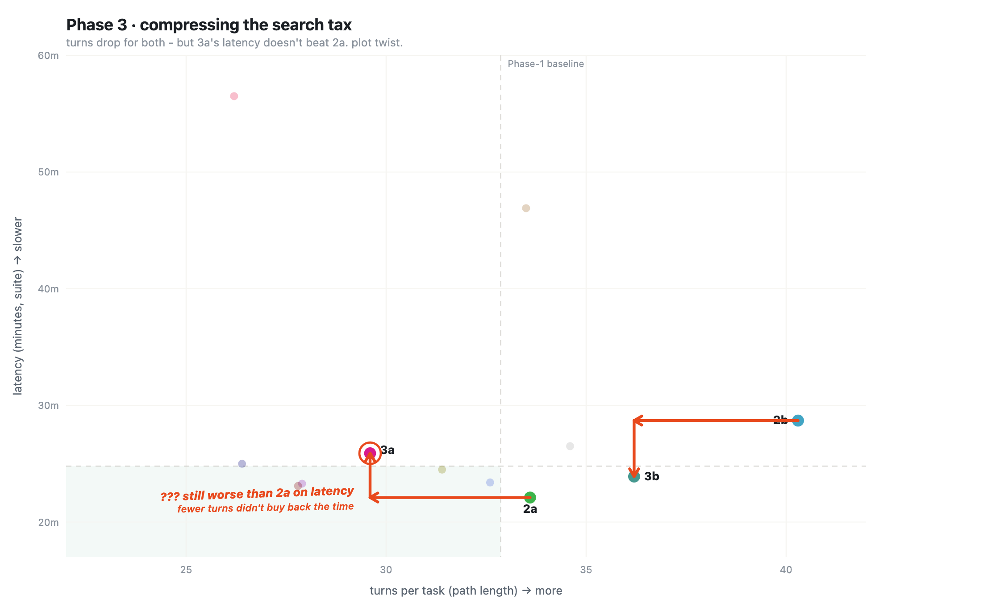
<figcaption style="max-width:640px;margin:0.6em auto 0;font-size:13px;font-style:italic;color:#6b675e;line-height:1.5">Same scalar-space plot; arrows track 2a&#8594;3a and 2b&#8594;3b. Turns drop for both moves; latency drops for 3b but not for 3a.</figcaption>
</figure>

### Phase 4
<figure style="text-align:center;margin:1.5em auto">

4a

Own study session forked into context

4b

Expert study session forked into context

</figure>

Phase 4 I decided to outright remove the dependency on the workspace and instead just internalize the priors into the context before the task.
This resulted in an explosion in context resulting in a dramatic increase in latency but there was a improvement in turn count, albeit not nearly enough to make up for the latency increase.

<figure style="text-align:center;margin:1.5em auto">
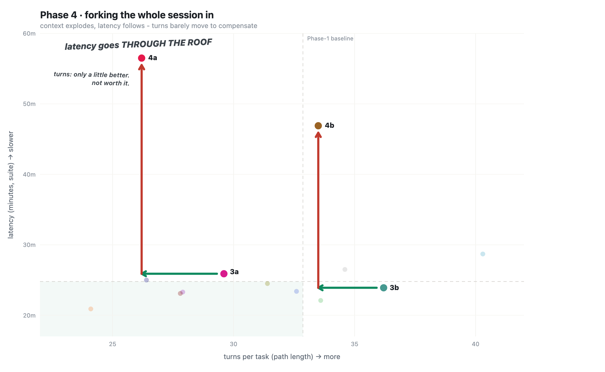
<figcaption style="max-width:640px;margin:0.6em auto 0;font-size:13px;font-style:italic;color:#6b675e;line-height:1.5">Same scalar-space plot; arrows track 3a&#8594;4a and 3b&#8594;4b. Nearly vertical: latency roughly doubles while turns move only slightly left.</figcaption>
</figure>

### Phase 5
<figure style="text-align:center;margin:1.5em auto">

5a

One combined recipe in the prompt

5b

Per-site recipe in the prompt

</figure>

In phase 5 I explored entirely stripping away the context and instead embedding a distillation of the priors into the task prompt.
Both saw an equal improvement over all prior arms.
The differerence between the two was that 5a did a single recepie for both sites while 5b dynamically passed one of two recepies based on the site.
This distinction had no influence on outcomes.

<figure style="text-align:center;margin:1.5em auto">

<figcaption style="max-width:640px;margin:0.6em auto 0;font-size:13px;font-style:italic;color:#6b675e;line-height:1.5">Same scalar-space plot; 5a/5b popped and ringed together (the two land close enough to be indistinguishable at this scale), with every prior arm shown mid-emphasis for context, grouped capstone-style: the phases-1-3 pack and the phase-4 forks.</figcaption>
</figure>

### Phase 6
<figure style="text-align:center;margin:1.5em auto">

6a

Single-task warm-up fork, tiny context

6b

Warm-up fork + site recipe

</figure>

Finally on phase 6 I stubbornly wanted to know if any amount of warming up could outweigh the added context tax.
I ran 6a (just a single warm up task) as a control and you could see that it already captured most of the turn savings as 4a but marginal improvements on latency.
Then I paired it with the the embedded analysis artifact from 5a and it not only improved in latency but also in turn count from 6a.

<figure style="text-align:center;margin:1.5em auto">
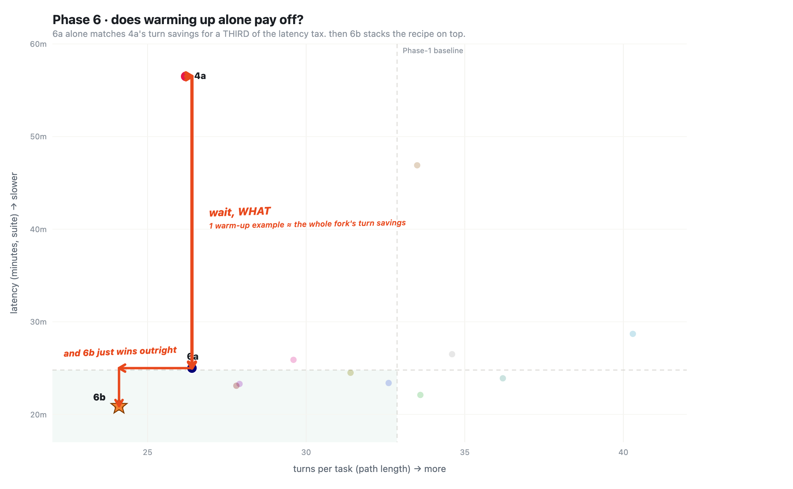
<figcaption style="max-width:640px;margin:0.6em auto 0;font-size:13px;font-style:italic;color:#6b675e;line-height:1.5">Same scalar-space plot; 4a&#8594;6a: turns barely move, latency collapses. 6a&#8594;6b: the recipe stacks on top and moves both axes further.</figcaption>
</figure>

## Conclusion

## Appendix
Here I really wanted to show this graphic so I created appendix just to show it.

<figure style="text-align:center;margin:1.5em auto">
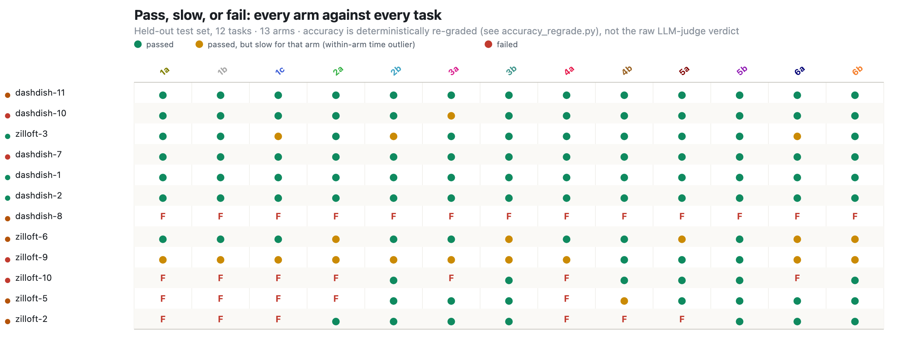
<figcaption style="max-width:680px;margin:0.6em auto 0;font-size:13px;font-style:italic;color:#6b675e;line-height:1.5">Every arm (columns) against every held-out task (rows). Green = passed; amber = passed but slow for that arm (a within-arm time outlier, robust MAD z-score &gt; 1.5 against that arm's own task times, not a fixed time threshold); red F = failed. Accuracy is the deterministically re-graded verdict (see accuracy_regrade.py), not the raw LLM-judge output. dashdish-8 fails for every arm; zilloft-2, zilloft-5, and zilloft-10 are the three tasks whose verdict varies by arm.</figcaption>
</figure>

# Scientific Scaffolding
## Abstract
- continual learning with a focus on latency
- ablation study across each factory varying conditions

## Methodology
- expert demonstrations (teacher demonstrations maybe)
    - caveat that I am not an expert for the site nor task but I am a human with a good deal of experience with navigating and building websites
- self generated experiences
- distillation
- playbook or the more practical form, a skill
- procedural knowledge knowledge is how to and the recepie (grounded in cognitive science)
- declarative knowledge is facts about the site like the analysis doc (grounded in cognitive science)
- cold vs warm start grounded in model weights priming but its a good analogy for the session forks
- verification: llm as judge, programmatic/rule-based verifiers
- latency: e2e latency, wall-clock latency per task, per-turn latency
- stock chromium browsers: chrome, brave, opera, edge
    - driven by extension (can also be driven by CDP)
- automation chromium: what puppeteer, playwright, etc. do
    - driven by CDP
- observation space: browser(my profile)
- action space: browser(my profile) + env
- agentic search: filesystem based retrieval
- harness: OCIC
- workspace: on disk working directory
- target: browser site

## Dataset
- dataset is not specially hard but it is long enough to explore latency
- run to run variance: prebuilt verifiers are not consistent to semantically equivalent llm outputs
- held out train vs test split

## Limitations
- 0$ budget (self imposed)
    - the moment I open the budget to >0 then it rapidly gets expensive
- parallelizing the process is not trivial with the current configuration of OCIC
- 

# Notes
hypothesis:
information article is the takeaways from this experiment - i did xyz and here are the results
hypothesis:
we came in with this hypothesis 
a good article has a hypothesis that matters

we are exploring several axis: correctness, latency, and efficiency  

Hypothesis:
HIGHER LEVEL HYPOTHESES:
naive procedural and declarative knowledge improves on the baseline? False, it depends on difficulty of the task, length of prior context, and methodology of prior context
expert demonstrations produce a stronger world model than self generated experiences?
LOWER LEVEL HYPOTHESES:
more experience leads to lower latency? False, it results in lower turn turn count, but it necessarily leads to higher latency by design of transformer models.
more experience results in higher accuracy? unknown, the dataset is not challenging enough to test this hypothesis.
distilling prior experience results in lower latency? True, but by merit of decreased turn count per task with an upfront cost of agentic search
